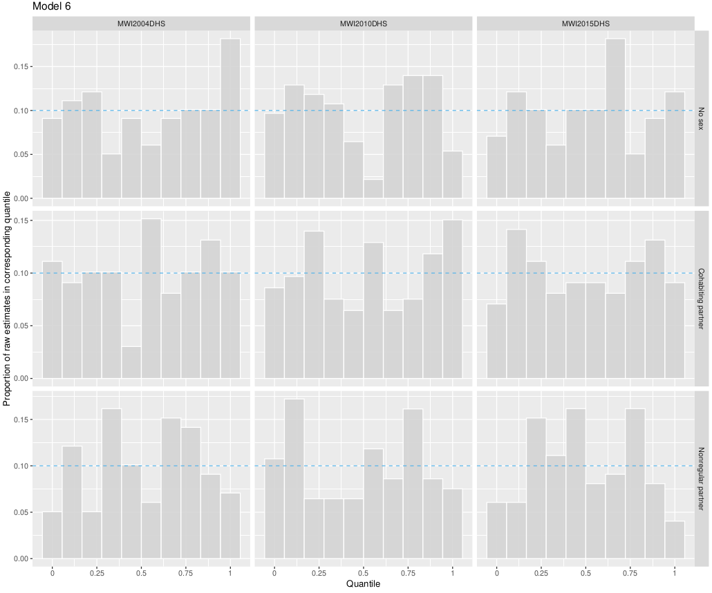
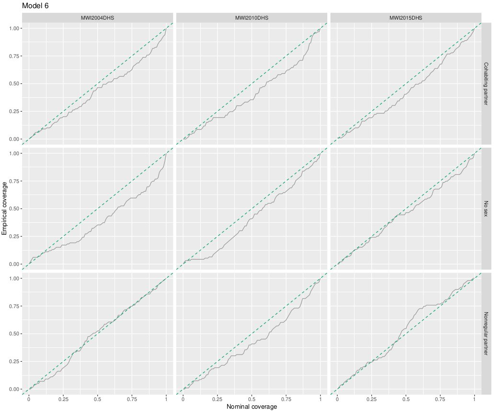

```{r echo = FALSE}
knitr::opts_chunk$set(echo = FALSE)
```

## Calibration

**Calibration** If I say something I mean it (in some weak probabilistic sense).

If I say "this event happens with probability $p$" then it does actually happen $p$ proportion of the time.

## Intervals

A **credible interval** is a Bayesian alternative to a confidence interval.

I think people often talk about them as if they are interchangeable, which is probably fine.
The difference is mostly about philosophical interpretation, and I'd guess most people talking about confidence intervals have the credible interval interpretation in mind.

## Confidence interval

A $(1 - \alpha)100$% **confidence interval** $[L, U]$ for a parameter $\theta$ is intended to have the property that $(1 - \alpha)100$% of intervals calculated according to the procedure contain $\theta$.

(According to frequentist interpretation, the probability that $\theta \in [L, U]$ is either 0 or 1, it either is or it isn't covered.
It's the interval rather than the parameter which is random.)    

## Credible interval

On the other hand, a $(1 - \alpha)100$% **credible interval** $[L, U]$ for $\theta$ is intended to have the (more natural) property that
$$
\mathbb{P}(L \leq \theta \leq U) = 1 - \alpha.
$$

Now this is a probability statement! We can talk about if these claims about coverage are calibrated.

## Example of credible intervals

For example, in the Naomi app often when you hover over a number it comes up with an interval (I think these are 90%).

It would be good if 90% of the time the actual number was contained within that interval! Then we can say that our app is **calibrated**.

## Expect to "be wrong" sometimes

**Note** this means we also want it to be outside the interval 10% of the time.
Saying you're 90% sure and being right 100% of the time is also an error.

It helps to have sample size.
For small sample size then if you're 90% sure then you'd hope you're right.

## Sharpness and SPSR

**Also note** that this isn't the only thing we care about.

If I tell you that the probability HIV prevalence is within $[0, 1]$ (no one to everyone) then you can't really fault my coverage, but also I'm not very useful.

Other thing we might care about is sharpness (saying more precise things).
Scoring rules assess these together.
Defining feature of (strictly) proper scoring rules is that they can't be gamed.

## Decomposition of SPSR

It would be nice is there was some type of decomposition along the lines of
$$
\text{score(forecast)} = \text{calibration(forecast)} + \text{sharpness(forecast)},
$$
Wikipedia says that:

> The expectation value of a proper scoring rule can be decomposed into the sum of three components, called uncertainty, reliability, and resolution.

## Using raw data rather than truth

How can we assess the calibration of our credible intervals?

As usual, we have the problem of not (and never being able to) know what the true value of the parameter is.

Workaround is to try to have the raw estimate (no model) be contained in the (modelled) interval instead.

## Nominal versus empirical

Compare 

* **nominal coverage**, probability we claimed that interval contains the number, to
* **empirical coverage**, proportion of intervals which actually contain the number.

Ideally they should be the same.

## Example

Say that the nominal coverage is 90%:

| Analyst   | $n$ | Inside the CrI | Empirical coverage | Diagnosis |
| --------- | --- | -------------- | ------------------ | --------- |
| Hai Kon   | 28  | 27             | 96%                | Overconfident |
| Relan     | 28  | 21             | 75%                | Underconfident |

*Any resemblance to real people living or dead is purely coincidental.*

##

**Criticism**: intervals are defined based on a particular significance level $\alpha$.
The choice of this significance level is *arbitrary* (a bad word).

How do we assess the calibration of our credible intervals for all possible $\alpha$?

##

```{r}
library(ggplot2)

ggplot() + 
  stat_function(fun = dnorm) +
  xlim(c(-3, 3)) +
  theme_void() +
  labs(title = "Posterior predictive distribution")
```

##

```{r}
ggplot() + 
  stat_function(fun = dnorm) +
  stat_function(fun = dnorm, xlim = c(-1.96, 1.96), geom = "area", alpha = 0.2) +
  xlim(c(-3, 3)) +
  theme_void() +
  labs(title = "Add a credible interval (equal-tailed)")
```

##

```{r}
ggplot() + 
  stat_function(fun = dnorm) +
  stat_function(fun = dnorm, xlim = c(-1.96, 1.96), geom = "area", alpha = 0.2) +
  geom_point(data = data.frame(x = 0.75, y = 0), aes(x = x, y = y), size = 5) +
  geom_label(data = data.frame(x = 0.75, y = 0.05, label = "Within interval"), aes(x = x, y = y, label = label)) +
  xlim(c(-3, 3)) +
  theme_void() +
  labs(title = "Suppose that this is the observation we get")
```

##

```{r}
ggplot() + 
  stat_function(fun = dnorm) +
  stat_function(fun = dnorm, xlim = c(-1.96, 1.96), geom = "area", alpha = 0.2) +
  geom_point(data = data.frame(x = 0.75, y = 0), aes(x = x, y = y), size = 5) +
  geom_label(data = data.frame(x = 0.75, y = 0.05, label = "Quantile: 0.674"), aes(x = x, y = y, label = label)) +
  xlim(c(-3, 3)) +
  theme_void() +
  labs(title = "Is it in the interval, yes or no, doesn't tell the full story.\nKnowing the quantile allows us to say if it's in any (equal-tailed) credible interval.")
```

##

Collection of posterior predictive quantile results $q_1, \ldots, q_n$, then what can we do?

**Main point** if our forecast is calibrated then $q_i \sim \mathcal{U}[0, 1]$ because the truth is a draw from the posterior predictive.
Sometimes called "Probability Integral Transform".

Hence "tests for discrete uniformity" [@sailynoja2021graphical].

## BP (before paper)

Prior to seeing the paper, I was making some plots to check if the quantiles in my models looked uniform:

1. **PIT-histograms** True value should lie in each decile 10% of the time so that the grey bars are level with the blue dashed line.
2. **Nominal coverage versus actual coverage** If nominal coverage equals actual coverage then the grey line should be along the green line.

## 

```{r}

```

##

```{r}

```

## AP (after paper)

* That second plot is alright, but how far can we reasonably expect the empirical coverage to stray from the nominal coverage? Especially when we are considerince all the possible confidence levels $\alpha$ simultaneously
* One answer provided by @sailynoja2021graphical who give "simultaneous confidence bands" which "jointly satisfy a desired coverage"
* Code is available: github.com/TeemuSailynoja/simultaneous-confidence-bands

##

```{r}
knitr::include_graphics("twitter_new1.png")
```

##

```{r}
knitr::include_graphics("twitter_new2.png")
```

## References {.allowframebreaks}
