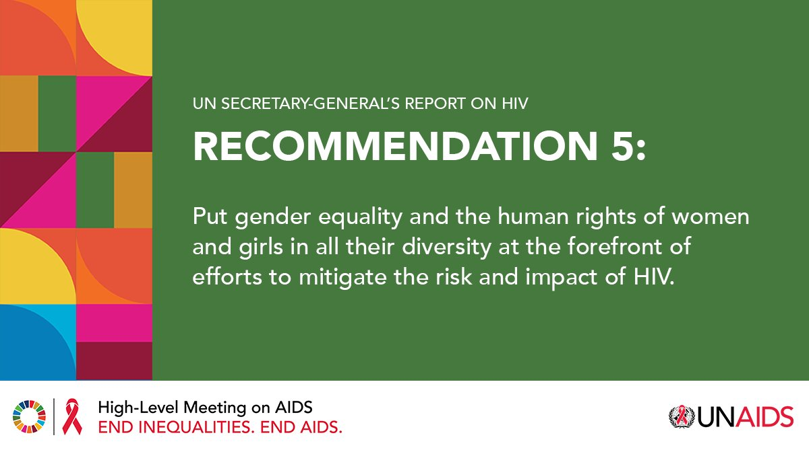
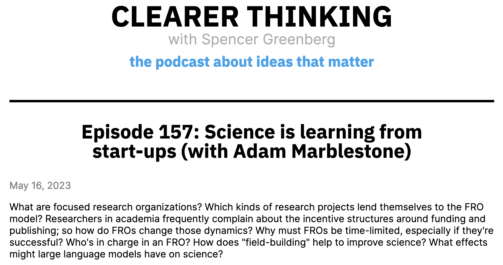
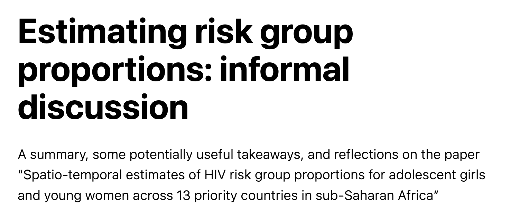
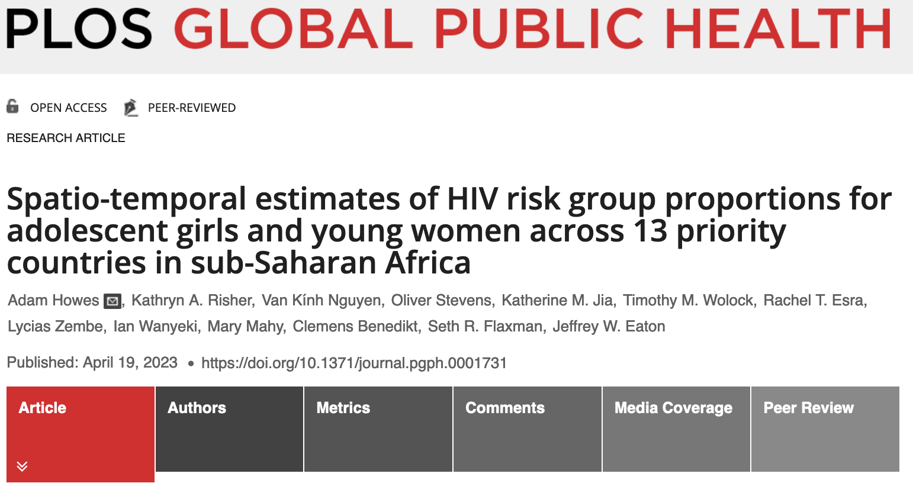

## Outline

1. Precision public health for HIV
2. Estimating risk group proportions
3. Some broader thoughts on careers

# 1. Precision public health for HIV

## What is precision public health

* In medicine, we want to deliver the right intervention, at the right time
* \textcolor{hilit}{Precision medicine} seeks to do that at the individual-level
* \textcolor{hilit}{Precision public health} seeks to do it at the population-level

##

::: columns

:::: column

> Recognizing that **"one size does not fit all"**, the Strategy prioritizes tailoring of differentiated service packages and service delivery approaches to the **unique needs of people, communities and locations**, using granular data to focus programmes most effectively.

::::

:::: column

```{r echo=FALSE, out.width = "125px", fig.cap="A key feature of the HIV response, both historically and into the future."}
knitr::include_graphics("global-aids-strategy.png")
```

::::

:::

## How can statistics help?

* \textcolor{hilit}{Granular estimates} of relevant quantities are required
* Disaggregation by \textcolor{hilit}{geography, sex, age, and behaviour}

\begin{center}
\begin{tcolorbox}[width=0.9\textwidth, colframe={title}, colback={white}, title={}]

\begin{itemize}
\item HIV prevalence: proportion of people who are infected
\item HIV incidence: rate of new infections
\item Antiretroviral therapy (ART) coverage: proportion of people living with HIV who take ART
\end{itemize}

\end{tcolorbox}
\end{center}

## 

```{r echo=FALSE, out.width = "300px", fig.cap="Example population health goals."}
knitr::include_graphics("fast-track.png")
```

# 2. Estimating risk group proportions

##

```{r warning=FALSE, echo=FALSE}
cbpalette <- c("#56B4E9", "#009E73", "#E69F00", "#F0E442", "#0072B2", "#D55E00", "#CC79A7", "#999999")

data.frame(
  x = c("28% of the population", "44% of new infections"),
  y = c(0.28, 0.44),
  level = c(2, 1)
) %>%
  ggplot(aes(x = level, y = y, fill = x)) +
    geom_col() +
    coord_flip() +
    geom_text(aes(label = x, y = 0.1), colour = "white", position = "dodge", size = 5) +
    scale_y_continuous(labels = scales::percent) +
    scale_fill_manual(values = cbpalette) +
    labs(x = "", y = "", title = "Adolescent girls and young women (AGYW) 15-29 are", caption = "(Across 13 AGYW priority countries in sub-Saharan Africa)") +
    guides(fill = "none") +
    theme_minimal() +
    theme(
      axis.title.y = element_blank(),
      axis.text.y = element_blank(),
      axis.ticks.y = element_blank()
    ) 
```

## Why?

1. Younger age at first sex
2. Age patterns of sexual mixing
3. Structural vulnerabilities and power imbalances
4. Increased susceptibility to HIV infection

##

```{r echo=FALSE, out.width = "250px", fig.cap="Convergence of marginal utility with equity and human rights."}

```

##

```{r echo=FALSE}
data.frame(
  price = c(20, 40, 50, 80, 70, 70, 50),
  effectiveness = c(80, 50, 60, 60, 50, 30, 40),
  name = c("Condoms and lube", "STI screening", "Male partner testing", "Access to PrEP", "Access to PEP", "Cash transfers and incentives", "Keep girls in school"),
  uncertainty = factor(c("More sure", rep("Less sure", times = 6)))
) %>%
  ggplot(aes(x = price, y = effectiveness, label = name, col = uncertainty)) +
    geom_text() +
    labs(x = "Price", y = "Real world effectiveness", title = bquote(bold("Insufficient resources") ~ "to provide all interventions to everyone"), caption = "Positions on plot depend on setting and should not be interpreted too precisely.\n Some interventions do not only have the effect of reducing HIV incidence.", col = "") +
    scale_color_manual(values = c("black", "#CC79A7")) +
    scale_x_continuous(breaks = c(10, 90), labels = c("Cheap", "Expensive"), limits = c(0, 100)) +
    scale_y_continuous(breaks = c(10, 90), labels = c("Works poorly", "Works well"), limits = c(0, 100)) +
    theme_minimal() +
    theme(
      panel.border = element_blank(),
      panel.grid.major = element_blank(),
      panel.grid.minor = element_blank(),
      axis.line = element_line(colour = "grey92", linewidth = 0.5, arrow = arrow(length = unit(5, "pt"), type = "open"))
    )
```

## How to prioritise interventions?

* The \textcolor{hilit}{most proximal drivers} of transmission are
$$
\mathbb{P}(\text{transmission}) \propto \text{sexual partnerships} \times \mathbb{P}(\text{each partner can transmit})
$$

##

```{r echo=FALSE}
x <- y <- c(1:4)

expand.grid(x, y) %>%
  mutate(risk = ifelse(Var2 > 1, Var1 * Var2, 0)) %>%
  ggplot(aes(x = Var1, y = Var2)) +
  geom_tile(aes(fill = risk)) +
  scale_fill_gradientn(
    colours = c("white", "#E69F00"),
    breaks = c(2, 14),
    labels = c("Less risk", "More risk") 
  ) +
  scale_x_continuous(breaks = c(1:4), labels = c("Low: <0.3%", "Moderate: 0.3-1%", "High: 1-3%", "Very high: >3%")) +
  scale_y_continuous(breaks = c(1:4), labels = c("None", "Low", "High", "Very\n high")) +
  labs(x = "Population-level HIV incidence", y = "Individual-level risk behaviour", title = bquote("Important we consider" ~ bold("both") ~ "population setting and individual behaviour"), fill = "") +
  theme_minimal() +
  theme(
    panel.border = element_blank(),
    panel.grid.major = element_blank(),
    panel.grid.minor = element_blank(),
    axis.line = element_line(colour = "grey92", linewidth = 0.5, arrow = arrow(length = unit(5, "pt"), type = "open"))
  )
```

## Individual-level behavioural risk

| Level       | Behavioural risk group             | Risk ratio |
|-------------|------------------------------------|------------|
| None        | Not sexually active                | 0          |
| Low         | One cohabiting partner             | 1          |
| High        | Multiple or non-regular partner(s) | 1.72       |
| Very High   | Female sex workers                 | 13         |

## What have we done

* Goal: enable \textcolor{hilit}{prioritisation} of HIV programming for AGYW
* Audience: programme managers, service providers and policy makers 
* Plan: estimate district-age-behavioural risk group proportions, HIV prevalences and HIV incidences across 13 high priority countries in sub-Saharan Africa
* Method: a Bayesian spatio-temporal model of survey data

##

```{r echo=FALSE, out.width="350px", fig.cap = "A total of 46 surveys: importantance of good data processing code!"}
knitr::include_graphics("depends/available-surveys.png")
``` 

##

```{r echo=FALSE, warning=FALSE, out.width="350px", fig.cap = "Example of model structure: we assume that neighbouring districts are similar."}
areas <- sf::read_sf("depends/zwe_areas.geojson")

areas %>%
  filter(area_level == 2) %>%
  arealutils::plot_graph(add_geography = TRUE)
```

##

```{r echo=FALSE, out.width="80%", fig.cap = "Direct survey estimates are too noisy to work with due to low sample sizes, but our modelled estimates don't have the same issue."}
knitr::include_graphics("depends/model-direct-benefits.png")
``` 

##

```{r echo=FALSE, out.width="80%", fig.cap = "We found a prominent geographic discontinuity between eastern and southen Africa in risk group membership for women 20-29."}
knitr::include_graphics("depends/aids-abstract-A.pdf")
``` 

##

```{r echo=FALSE, out.width="80%", fig.cap = "Supposing you prioritised those in the highest incidence strata, what percent of new infections could you find per percent of the population reached?"}
knitr::include_graphics("depends/infections-reached.pdf")
``` 

## Where might this work go

* Extension to adults 15-49 and further countries
* Generation of estimates led by country teams as a part of a yearly process: data ownership, data use, and data quality

##

```{r echo=FALSE, out.width = "300px", fig.align='center', fig.cap = "Example of user interface for estimates generation."}
knitr::include_graphics("naomi_user.png")
```

# 3. Some broader thoughts on careers

##

* Upside: could \textcolor{hilit}{influence health outcomes for many people}
* Downside: part of a (more?) complex theory of change

\begin{align*}
\mathbb{P}(\text{impact}) = &\mathbb{P}(\text{relevant people interact with your work}) \\
&\times \mathbb{P}(\text{what you've done is useful}) \\
&\times \mathbb{P}(\text{message correctly conveyed}) \times \cdots \\
&\times \mathbb{P}(\text{intervention technically works}) \\
&\times \mathbb{P}(\text{intervention correctly implemented}) \times \cdots
\end{align*}

* How does this balance out?

## About me

* Maths undergraduate $\to$ statistics masters $\to$ statistics (and machine learning, sort of) PhD
* Involved with Effective Altruism during my masters, and since then I've been interested in impactful applications of statistics

## Applied methodology

* Being good (perhaps not great) at a useful enough collection of things
* Feeling like no one care about the application at methods conferences, and no one cares about the methods at application conferences

## Team science

* A lot of disciplines required: Epidemiology, public health, health economics, behavioural science, implementation science, mathematics, statistics, computer science, software engineering
* Academia pushes against this by wanting every contribution to be marginally interesting in each field

##

```{r echo=FALSE, out.width = "300px", fig.align='center', fig.cap = "Alternative structures for science."}

```

## Thanks for listening!

* More information on my website: `athowes.github.io/about`
* Feel free to get in contact if I can be useful: `ath19@ic.ac.uk`
* My PhD is supervised by Seth Flaxman and Jeff Eaton, and the risk group work is in collaboration with Imperial's HIV Inference Group, within the MRC Centre for Global Infectious Disease Analysis, and UNAIDS

```{r echo=FALSE, out.width = "300px", fig.align='center'}
knitr::include_graphics("mrc-gida-icl-mlgh.png")
```

##

```{r echo=FALSE, out.width = "300px", fig.align='center', fig.cap = "For more (informal!) take a look at the blog post on my website`"}

```

##

```{r echo=FALSE, out.width = "300px", fig.align='center', fig.cap = "For more (formal!) take a look at the paper."}

```
